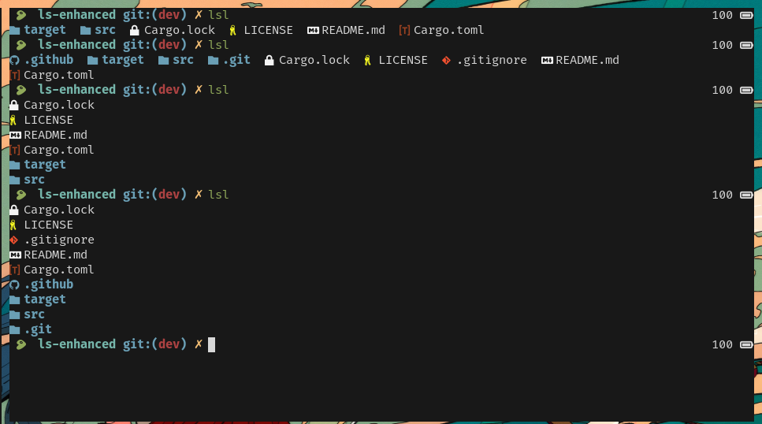

<p align="center"></p>
<h3 align="center">a better looking file listing tool</h3>
<hr />



<p><a href="https://github.com/lelouchfr/ls-enhanced"></a> <a href="https://crates.io/crates/ls-enhanced"></a></p>

## Installation

### using cargo:

```bash
cargo install ls-enhaced --locked
```

for a better usablility, add an alias to the command:

```bash
alias lse="ls-enhaced"
```

### from source:

```bash
git clone https://github.com/LelouchFR/ls-enhaced.git
mkdir ~/.config/lse
mv .github/config.toml ~/.config/lse/config.toml
cargo run
```

add an alias in you environment:

```bash
alias lse="path/to/executable"
```

#### Ups and Downs of using from source:

if you use the cargo version, you don't have to add the config file yourself, it will be generated for you automatically on first execution, but it will be a little "messy", not like the version build from source.
